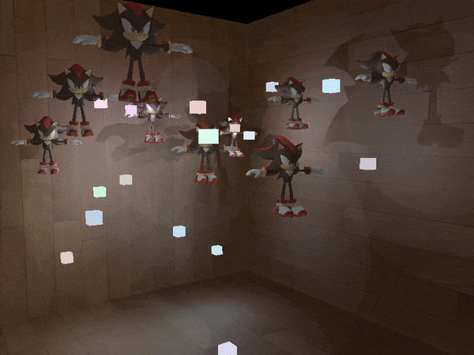

Reasonably-extensible deferred renderer written in modern OpenGL (version 3.3... for now!) based (increasingly-loosely) on Joey DeVries deferred rendering tutorial (https://learnopengl.com/Advanced-Lighting/Deferred-Shading)

Featuring omnidirectional shadows, as well as omnidirectional Shadows! Press tab to toggle visibility of the different gbuffer layers!

I've checked prebuilt dependencies into this git repo for the sake of (potential) convenience, but in case you're not on a compatible platform, I've written a brief list of setup instructions below. 

Note that if you want to build this outside of Visual Studio, you may have to roll your own cmake file.

Setup:

1). Compile glfw from source (https://www.glfw.org/download.html) --> Add it to an external include directory.

2). Set up GLAD (specifically GLAD1) (https://github.com/Dav1dde/glad)
  - Use this web service: https://glad.dav1d.de/
  - Select an OpenGL version of at least 3.3, with profile set to Core and the "Generate a loader" option ticked.
  - Copy both include folders (glad and KHR) into your external include directory.

3). Setup GLM in much the same way as you set up glfw. (https://glm.g-truc.net/0.9.8/index.html)

4). Compile and setup assimp. This will likely involve copying the lib file into this project's lib directory, as well as copying the relevant .dll into the build folder (e.g. x64/Debug). 
